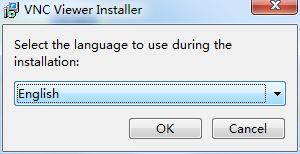
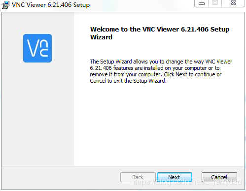
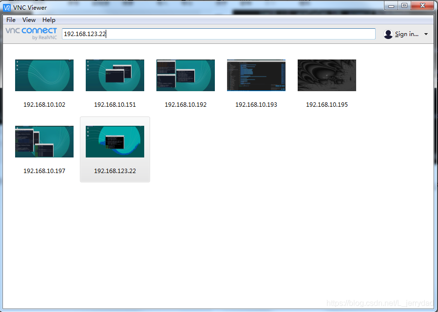
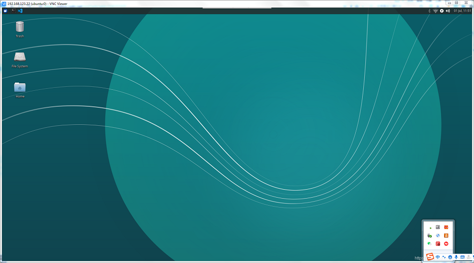

# 设置VNC
## 使用VNC远程连接小车桌面
看到这里你可能会有疑问了，我的小车是要自由自在到处溜达的，如果一直连着一块屏幕，该如何驰骋。
这里我们可以使用VNC远程桌面解决这个问题

VNC (Virtual Network Console)是虚拟网络控制台的缩写。它是一款优秀的远程控制工具软件，VNC 是基于 UNIX 和 Linux 操作系统的免费的开源软件，远程控制能力强大，高效实用。VNC基本上是由两部分组成：一部分是客户端的应用程序(vncviewer)  ；另外一部分是服务器端的应用程序(vncserver)。
## 1.在小车的系统中安装VNCserver
1. 首先打开一个控制台终端(快捷键<kbd>Ctrl</kbd>+<kbd>Alt</kbd>+<kbd>T</kbd>),输入如下指令，更新软件源库：

```c
sudo apt-get update 
```
2. 安装VNCserver，在终端输入以下命令：

```c
sudo apt-get install vnc4server
```
3. 启动vnc4server，在终端输入以下命令：

```c
vnc4server
```
此时系统会提示你输入密码，在通过客户端链接时将会用到这个密码。
输入完密码后你将看到类似下边的提示：

> New ‘3 ()’ desktop is ****:3 (****代表主机名） Take notice of the number
> after the colon (, in this case it is “3.”

启动完vnc4server后在你的主目录下将会产生一个.vnc的目录。
此时就可以通过vnc客户端链接到服务器了。

## 2.在电脑上安装VNCviewer

打开浏览器，进入网址：[https://www.realvnc.com/en/connect/download/viewer/](https://www.realvnc.com/en/connect/download/viewer/)

选择电脑所对应的系统，下载安装文件。


开始安装，语言可以选择英语，德语，法语，意大利语和西语，点击ok进入下一步：


然后一直点“next”，使用默认的设置即可


## 3.电脑端远程连接小车桌面
首先在小车的终端命令行中输入:**ifconfig**  查看小车的IP地址，这里我得地址是192.168.123.22.。IP地址是动态变化的，也会随着连接不同的WIFI而变化，所以每次开机后，建议都查看一下IP地址，确认是否有变化。


在电脑端打开VNCviewer客户端，在顶部小窗口内输入我们刚才读到的小车IP地址然后回车。


点击“continue”


输入我们在小车上设置的VNCserver的密码，建议勾选“Remember password”方便下次登录时就不需要再输入密码。然后点击“ok”


大功告成，现在我们就可以在电脑上远程连接小车的桌面并进行操控了。

