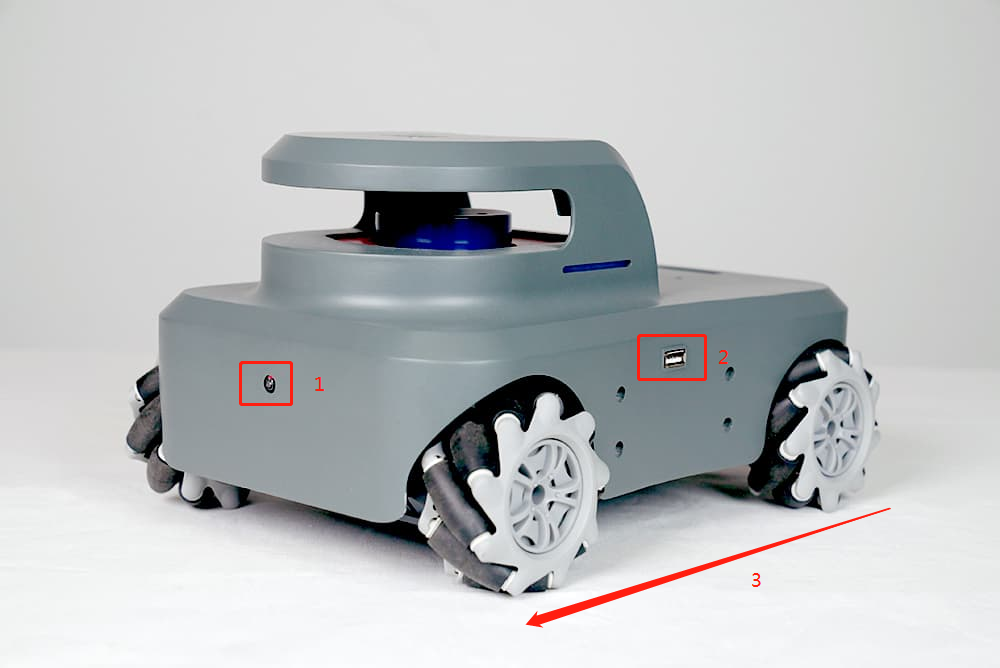
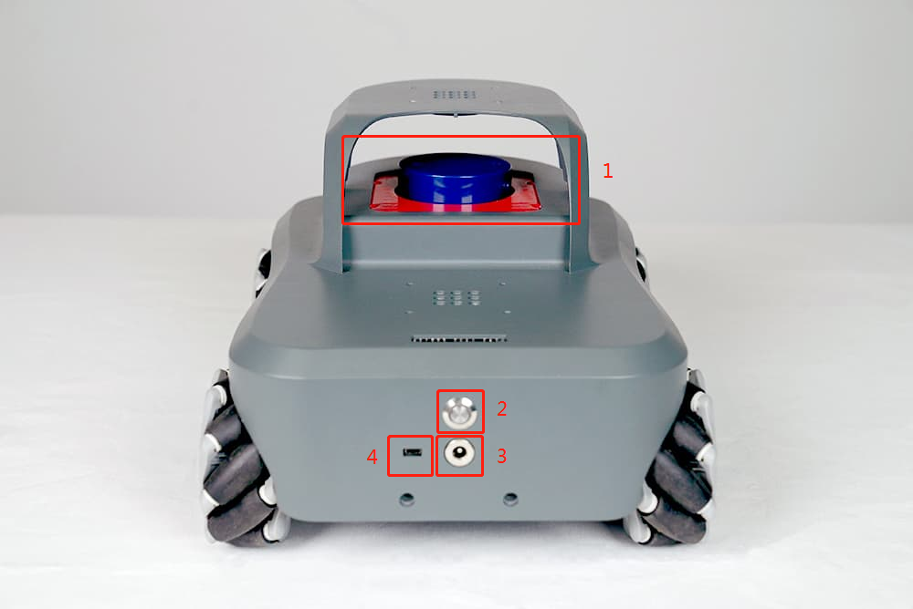
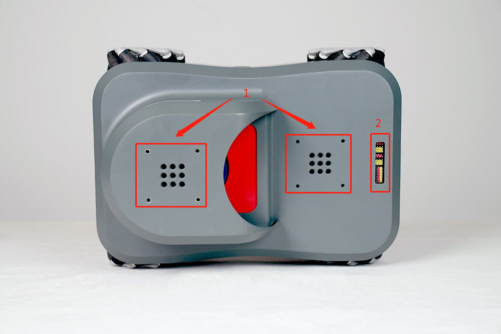
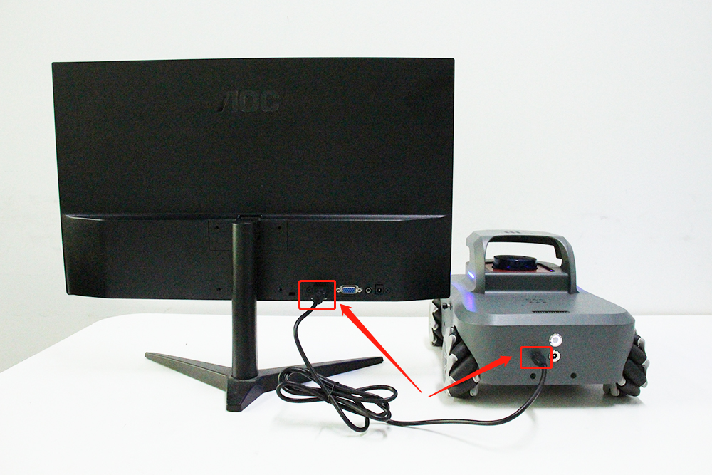
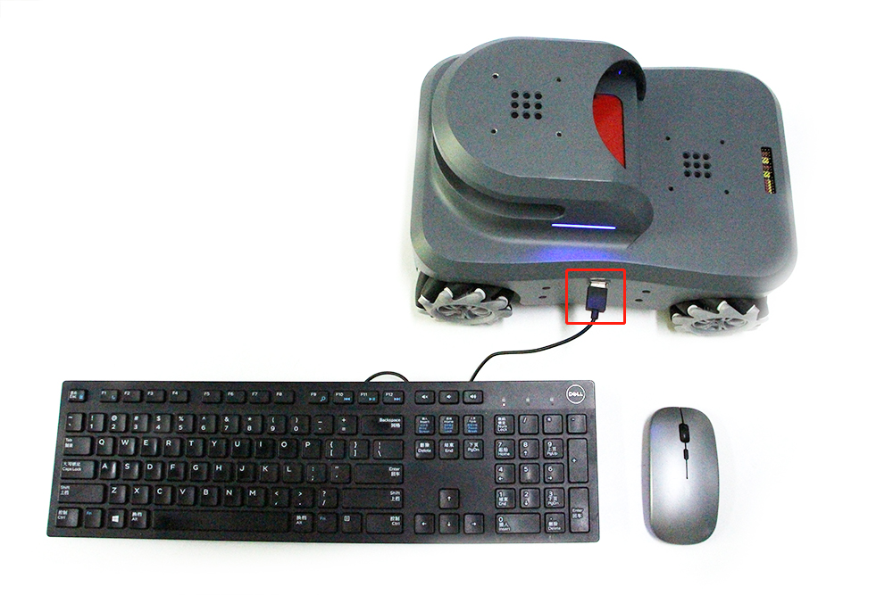
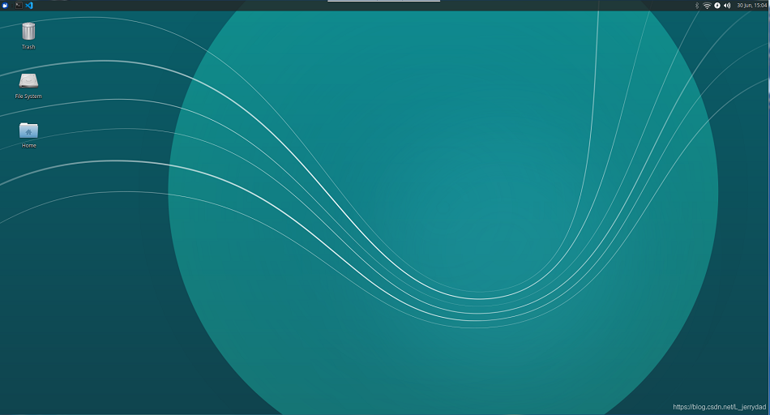
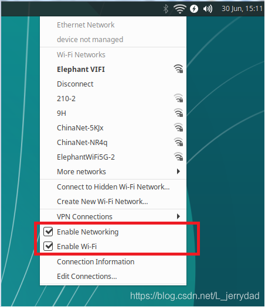
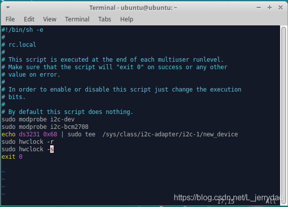
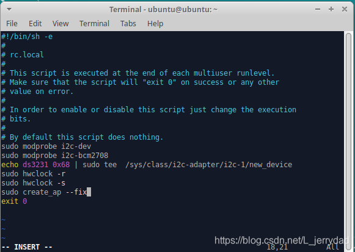

# myAGV初次使用
> 首先恭喜你获得了一台充满趣味的myAGV(Automated Guided Vehicle)
> 利用这台先进的小车你可以尽情的发挥脑洞去创造和实现各种天马行空的功能
> 那么，我们开始吧

##  1.myAGV简介

> myAGV采用了麦克纳姆轮+激光雷达+高精度摄像头方案
> 麦克纳姆轮是什么：麦克纳姆轮的设计原理是在车轮的外环中安装了与轴心成45度角排列的辊子与地面接触，转动时摩擦力会产生与轮轴呈45度的反推力，这个斜向推力可以被分为纵向和横向两个向量。整个车体由两对拥有辊子镜像排列的麦克纳姆轮所驱动，每个车轮各自会产生相应的向量，这些向量的合力决定了车体最终的活动状态。通过调节各个车轮独自的转向和转速，可以实现整个车体前行、横移、斜行、旋转及其组合等运动方式。


1.高精度摄像头  2.USB接口   3.小车前进方向


1.激光雷达  2.电源开关   3.充电口  4.HDMI接口


1.乐高件接口  2.拓展pin引脚 


## 2.开机
### 1.连接HDMI接口到显示器
启动小车前，一定要先连接好屏幕，通过HDMI传输线连接小车的HDMI接口与屏幕的HDMI接口。这是因为小车的系统在启动时，必需要连接一个实体屏幕才可以正常启动小车的操作系统。


### 2.连接键盘鼠标
小车内置了一块树莓派开发板，在小车的左右两边各有一个USB接口，如下图连接键盘和鼠标


### 3.按下开机按钮
按下开机按钮以启动小车，等待一分钟左右，便会进入登录界面。一般初始密码为：aibot1234
进入系统后桌面应如下：

## 3.联网

第一次开机后，我们可以让小车连上wifi，方便我们下载软件及更新代码
首先点击右上角的这个图标：


点开后勾选Enable Networking及Enable Wi-Fi，确保这两个选项前有两个对号 √



此时就可以看到我们附近可以连接的wifi信息了，选中你的wifi输入密码即可成功联网。
如果勾选后无法显示附近的wifi信息，可以打开一个终端控制台(快捷键<kbd>Ctrl</kbd>+<kbd>Alt</kbd>+<kbd>T</kbd>),输入如下指令：

```c
sudo create_ap --fix
```
这个指令在每次开机后都需要执行一次，如果不想太麻烦，可以把这个命令保存在配置文件中，操作如下：
1. 在终端输入以下指令打开配置文件：
```c
sudo vim /etc/rc.local 
```
2. 出现编辑器界面，用键盘方向键控制光标移动到如下位置：



3. 按下键盘 <kbd>o</kbd> 键进入编辑，将我们的指令：sudo create_ap --fix 添加到文件中：



4. 然后按<kbd>Esc</kbd>退出编辑模式，按<kbd>Shift</kbd>+<kbd>:</kbd>,然后输入 wq 保存文件并退出编辑。


**以上就是小车开箱后第一次使用的一些初始化操作，祝您玩的愉快！**
