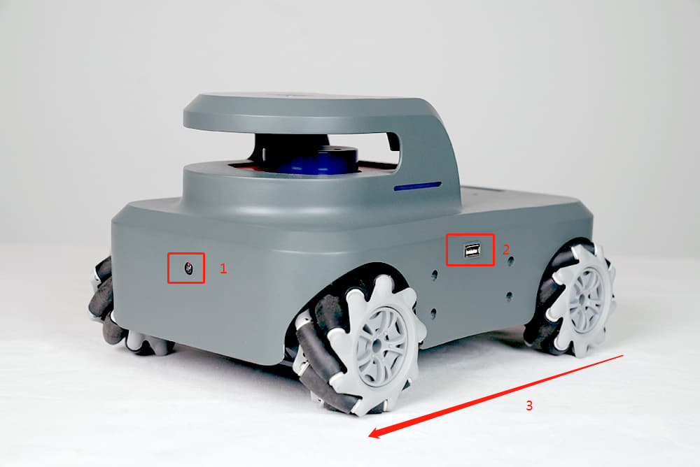
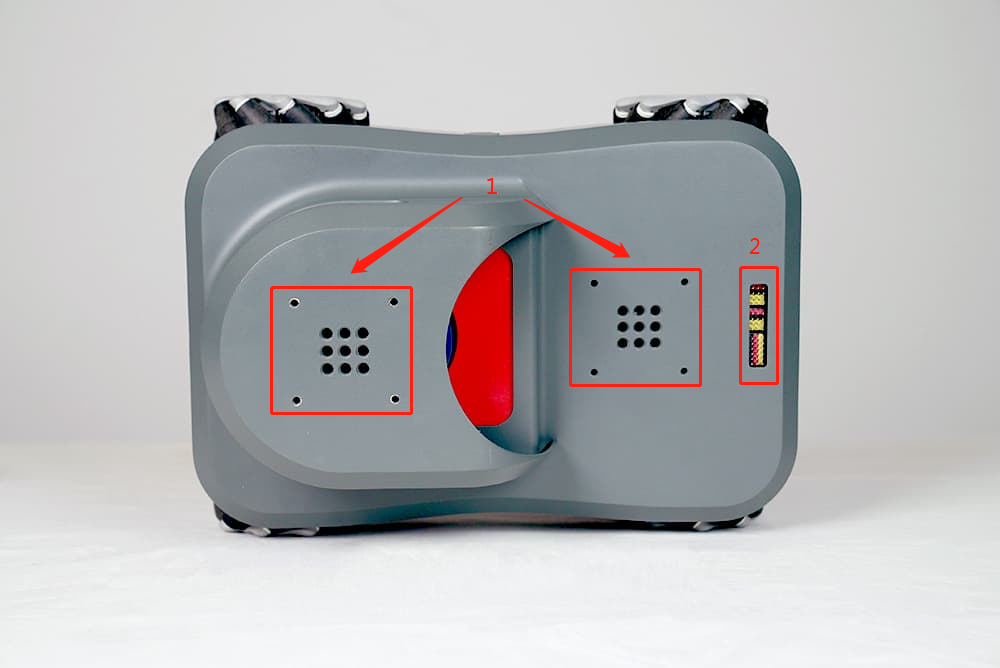
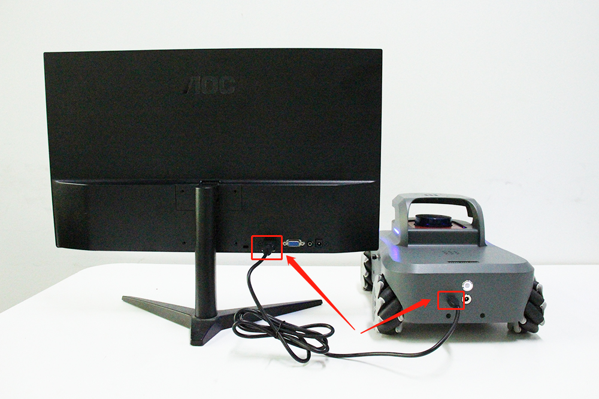
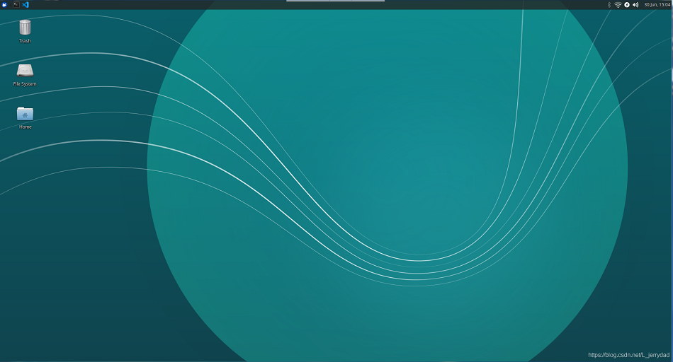
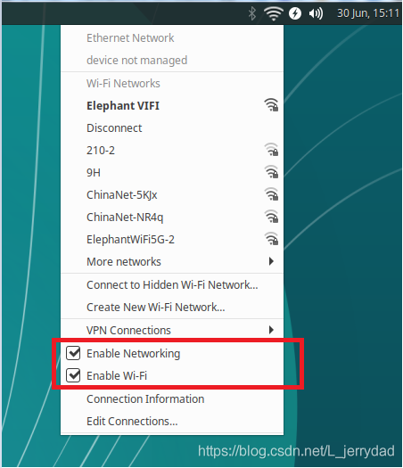

# MYAGV小车初次使用
> 首先恭喜你获得了一台充满趣味的AGV(Automated Guided Vehicle)小车
> 利用这台先进的小车你可以尽情的发挥脑洞去创造和实现各种天马行空的功能
> 那么，我们开始吧

# 1.小车简介  

> AGV采用了麦克纳姆轮+激光雷达+高精度摄像头方案
> 麦克纳姆轮是什么：麦克纳姆轮的设计原理是在车轮的外环中安装了与轴心成45度角排列的辊子与地面接触，转动时摩擦力会产生与轮轴呈45度的反推力，这个斜向推力可以被分为纵向和横向两个向量。整个车体由两对拥有辊子镜像排列的麦克纳姆轮所驱动，每个车轮各自会产生相应的向量，这些向量的合力决定了车体最终的活动状态。通过调节各个车轮独自的转向和转速，可以实现整个车体前行、横移、斜行、旋转及其组合等运动方式。


1.高精度摄像头  2.USB接口   3.小车前进方向


1.激光雷达  2.电源开关   3.充电口  4.HDMI接口


1.乐高件接口  2.拓展pin引脚 


# 2.开机
## 1.连接HDMI接口到显示器
启动小车前，一定要先连接好屏幕，通过HDMI传输线连接小车的HDMI接口与屏幕的HDMI接口。这是因为小车的系统在启动时，必需要连接一个实体屏幕才可以正常启动小车的操作系统。


## 2.连接键盘鼠标
小车内置了一块树莓派开发板，在小车的左右两边各有一个USB接口，如下图连接键盘和鼠标


## 3.按下开机按钮
按下开机按钮以启动小车，等待一分钟左右，便会进入登录界面。一般初始密码为：aibot1234
进入系统后桌面应如下：

# 3.联网

第一次开机后，我们可以让小车连上wifi，方便我们下载软件及更新代码
首先点击右上角的这个图标：


点开后勾选Enable Networking及Enable Wi-Fi，确保这两个选项前有两个对号 √



此时就可以看到我们附近可以连接的wifi信息了，选中你的wifi输入密码即可成功联网。
如果勾选后无法显示附近的wifi信息，可以打开一个终端控制台(快捷键<kbd>Ctrl</kbd>+<kbd>Alt</kbd>+<kbd>T</kbd>),输入如下指令：

```c
sudo create_ap --fix
```
这个指令在每次开机后都需要执行一次，如果不想太麻烦，可以把这个命令保存在配置文件中，操作如下：
1. 在终端输入以下指令打开配置文件：
```c
sudo vim /etc/rc.local 
```
2. 出现编辑器界面，用键盘方向键控制光标移动到如下位置：

3. 按下键盘 <kbd>o</kbd> 键进入编辑，将我们的指令：sudo create_ap --fix 添加到文件中：

4. 然后按<kbd>Esc</kbd>退出编辑模式，按<kbd>Shift</kbd>+<kbd>:</kbd>,然后输入 wq 保存文件并退出编辑。

# 4.使用VNC远程连接小车桌面
看到这里你可能会有疑问了，我的小车是要自由自在到处溜达的，如果一直连着一块屏幕，该如何驰骋。
这里我们可以使用VNC远程桌面解决这个问题

VNC (Virtual Network Console)是虚拟网络控制台的缩写。它是一款优秀的远程控制工具软件，VNC 是基于 UNIX 和 Linux 操作系统的免费的开源软件，远程控制能力强大，高效实用。VNC基本上是由两部分组成：一部分是客户端的应用程序(vncviewer)  ；另外一部分是服务器端的应用程序(vncserver)。


## 1.在小车的系统中安装VNCserver
1. 首先打开一个控制台终端(快捷键<kbd>Ctrl</kbd>+<kbd>Alt</kbd>+<kbd>T</kbd>),输入如下指令，更新软件源库：

```c
sudo apt-get update 
```
2. 安装VNCserver，在终端输入以下命令：

```c
sudo apt-get install vnc4server
```
3. 启动vnc4server，在终端输入以下命令：

```c
vnc4server
```
此时系统会提示你输入密码，在通过客户端链接时将会用到这个密码。
输入完密码后你将看到类似下边的提示：

> New ‘3 ()’ desktop is ****:3 (****代表主机名） Take notice of the number
> after the colon (, in this case it is “3.”

启动完vnc4server后在你的主目录下将会产生一个.vnc的目录。
此时就可以通过vnc客户端链接到服务器了。

## 2.在电脑上安装VNCviewer

打开浏览器，进入网址：[https://www.realvnc.com/en/connect/download/viewer/](https://www.realvnc.com/en/connect/download/viewer/)

选择电脑所对应的系统，下载安装文件。


开始安装，语言可以选择英语，德语，法语，意大利语和西语，点击ok进入下一步：


然后一直点“next”，使用默认的设置即可


## 3.电脑端远程连接小车桌面
首先在小车的终端命令行中输入:**ifconfig**  查看小车的IP地址，这里我得地址是192.168.123.22.。IP地址是动态变化的，也会随着连接不同的WIFI而变化，所以每次开机后，建议都查看一下IP地址，确认是否有变化。


在电脑端打开VNCviewer客户端，在顶部小窗口内输入我们刚才读到的小车IP地址然后回车。


点击“continue”


输入我们在小车上设置的VNCserver的密码，建议勾选“Remember password”方便下次登录时就不需要再输入密码。然后点击“ok”


大功告成，现在我们就可以在电脑上远程连接小车的桌面并进行操控了。


**以上就是小车开箱后第一次使用的一些初始化操作，祝您玩的愉快！**
