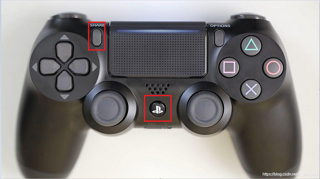
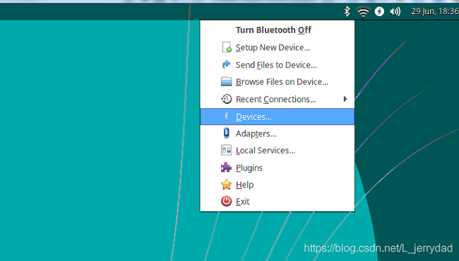
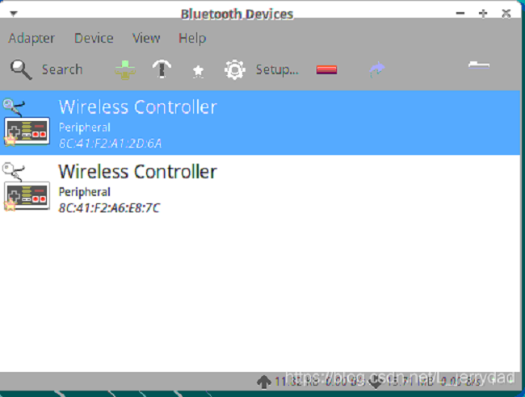
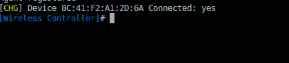
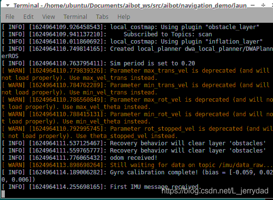
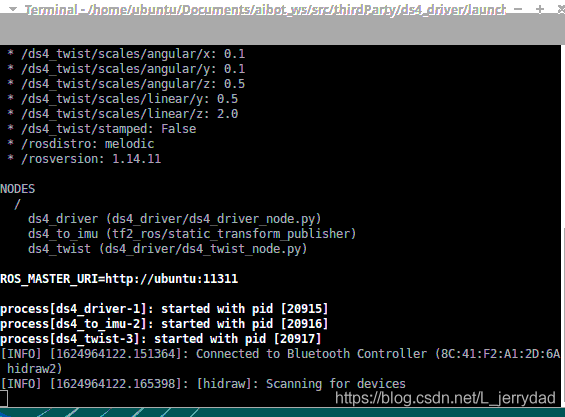

# myAGV-PS4手柄控制

## 1.连接手柄

### 1.建立串口和蓝牙协议层的数据连接通道
打开一个控制台终端(快捷键<kbd>Ctrl</kbd>+<kbd>Alt</kbd>+<kbd>T</kbd>)，在终端输入以下指令：

```bash
sudo hciattach /dev/ttyAMA0 bcm43xx 921600 noflow -
```
成功标志: 

> Device setup complete

如果出现timeout再运行一次，直到出现 Device setup complete
### 2.注册蓝牙控制
在终端输入以下命令，注册蓝牙控制并进入蓝牙控制命令行：

```bash
sudo bluetoothctl
```
### 3.power on
在终端输入以下命令：

```bash
power on
```
成功标志：

> Agent registered

### 4.discoverable on
在终端输入以下命令：

```bash
discoverable on
```
成功标志：

> Changing discoverable on succeeded
### 5.scan on
在终端输入以下命令：

```c
scan on
```
成功标志：

> Discovery started
### 6.配对
1.首先长按**ps**和**share**键五秒，看到指示灯快速闪烁就可以配对


2.在界面中右上角找到蓝牙标志，点击蓝牙->Devices，可以看到遥控手柄的地址，比如我这里的是 8C:41:F2:A1:2D:6A


3.配对我们的手柄设备，在终端中输入(这里的ADDR是刚才我们读到的地址，实际连接时输入你读到的设备地址)：

```bash
pair  8C:41:F2:A1:2D:6A  //这里的ADDR是刚才我们读到的地址，实际连接时输入你读到的设备地址
```

4.连接我们的手柄设备，在终端中输入((这里的ADDR是刚才我们读到的地址，实际连接时输入你读到的设备地址)：

```bash
connect 8C:41:F2:A1:2D:6A  //这里的ADDR是刚才我们读到的地址，实际连接时输入你读到的设备地址**
```
5.可以看到设备连接成功，此时手柄指示灯为蓝色常亮
成功标志：

> Connected：yes


## 2.开启小车的launch文件
打开一个新的控制台终端，在命令行中输入：

```bash
roslaunch navigation_demo myagv_navigation.launch
```
成功标志：

> First imu received.



## 3.开启手柄控制launch文件

打开一个新的控制台终端，在命令行中输入：

```bash
roslaunch ds4_driver ds4_twist.launch
```
成功标志：Connected to Bluetooth Controller +[ADDR] 



如果成功走到这里了，就可以成功用手柄控制小车的行走了，因为手柄没有调速的功能，车速会比较快，所以要小心驾驶。
