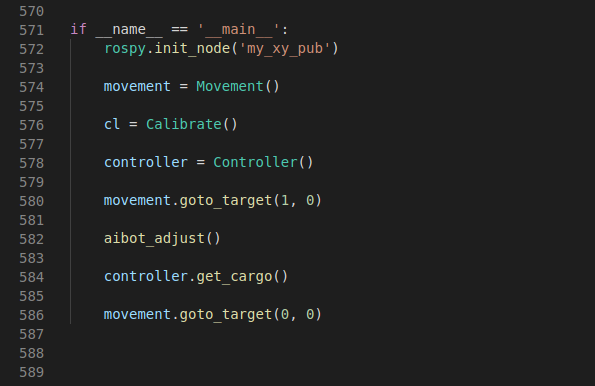

# 小车机械臂联动
## 控制原理
通过myAGV小车内的树莓派以及Linux操作系统，可以实现对mycobot系列机械臂的控制
>这个Demo中，程序会驱动myAGV先到达指定点位附近，然后通过精准定位停在放置了目标物体的台子前。然后控制机械臂识别目标物体，进行抓取并放到myAGV的车上。最后带着物体回到我们的起始位置完成一个远程定点取物并带回起点的操作。
### myAGV
利用小车的激光雷达提前建好场景地图，并利用摄像头和Aruco标记精准定位
### mycobot机械臂
机械臂的控制可以参考[https://www.elephantrobotics.com/docs/myCobot-en/](https://www.elephantrobotics.com/docs/myCobot-en/)
机械臂视觉识别也是通过将Aruco标记粘贴在目标物体表面，根据Aruco标记获取的位姿信息，控制机械臂及末端吸泵到达相应的点位进获取。
*有关Aruco的相关介绍可以参照定位章节*

## 代码实现
在代码中主要实现的逻辑流程如下

### 流程拆解
1. rospy.init_node('my_xy_pub')
首先创建一个节点，这里我得节点名为 my_xy_pub 用于向ROS服务发送数据

2. movement = Movement()
   实体化一个Movement类,用来控制小车的移动

3. cl = Calibrate()
   实体化一个Calibrate类，用来控制小车的精准定位时的移动

4. controller = Controller()
   实体化一个Controller类，用来控制机械臂的动作

5. movement.goto_target(1, 0)
   调用movement类下的goto_target 函数，让小车到达地图坐标中(1, 0)坐标的点位

6. aibot_adjust()
   在到达(1, 0)坐标位置后，开启小车的精准定位，使小车可以精确到达放置目标物体的台子前面

7. controller.get_cargo()
   控制机械臂进行视觉识别并抓取带有Aruco标记的目标物体,将物体放置在myAGV的背部平台上

8. movement.goto_target(0, 0)
   携带着目标物体回到坐标(0, 0)的位置上，也就是我们最开始的起点

## 实际操作

1. 打开一个终端 (快捷键 <kbd>Ctrl</kbd>+<kbd>Alt</kbd>+<kbd>T</kbd>) 然后输入以下指令:
```bash
roslaunch navigation_demo myagv_navigetion.launch
```
2. 打开另一个终端，输入以下指令：
```bash
roslaunch mycobot_ros mycobot_detect_marker_with_topic.launch
```
3. 再打开另一个终端，进入存放reach_pump.py的文件夹路径下,
    然后输入以下指令：
```bash
python2 reach_pump.py
```
*比如说像我得reach_pump.py文件存放在以下路径中:/home/ubuntu/Documents/aibot_ws/src/Thirtyparty/mycobot_ros/scripts*