# MYAGV小车地图导航

在之前我们已经建好了一个空间地图并获得了两个地图文件，分别是在家目录下的 map.pgm  和 map.yaml

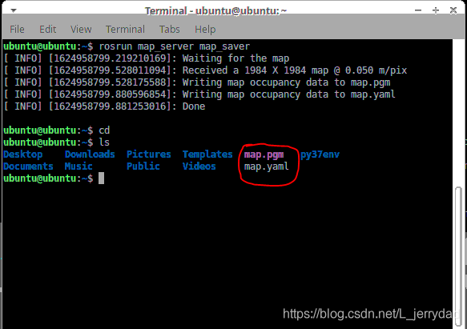

 现在来看一下如何用建立好的地图来为小车进行导航

# 1.复制地图文件到项目文件夹对应的位置
1. 点击桌面上的File system图标打开文件管理器，点击右侧的“ubuntu”进入/home/ubuntu 目录
2. 可以看到之前我们建好的地图就保存在这个路径下，选中这两个文件
3. 单击右键，点击Copy复制这两个文件
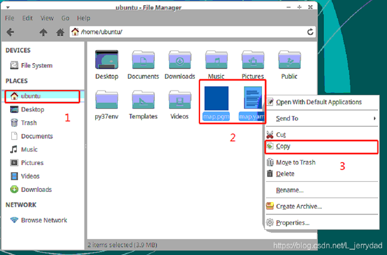
4. 点击桌面上的File system图标打开另一个文件管理器进入如下路径，将刚才复制的地图文件粘贴到该路径下：
 > /home/ubuntu/Documents/aibot_ws/src/aibot/navigation_demo/maps/
 
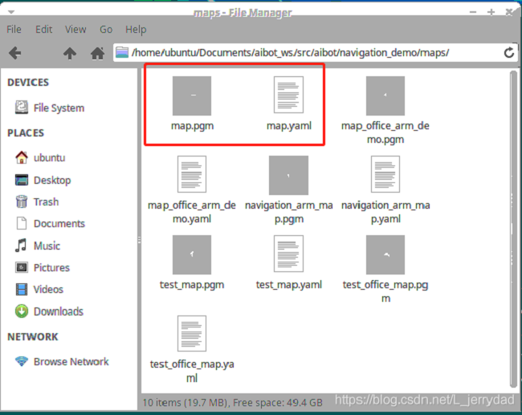

# 2.修改launch文件
1. 双击打开左上角的Visual Studio Code 打开代码编辑器，

2. 打开/home/ubuntu/Documents/aibot_ws/src/aibot/navigation_demo/launch/路径下的 myagv_navigation.launch文件
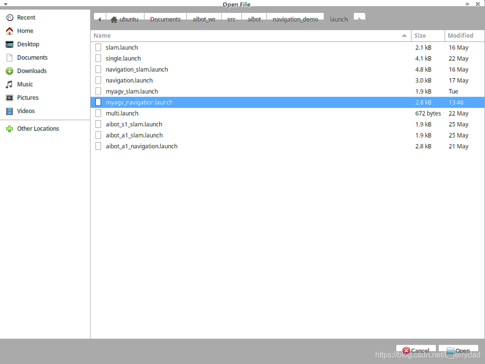
3. 将第6行的 map_office_arm_demo.yaml 替换成我们自己建图的文件名 map.yaml
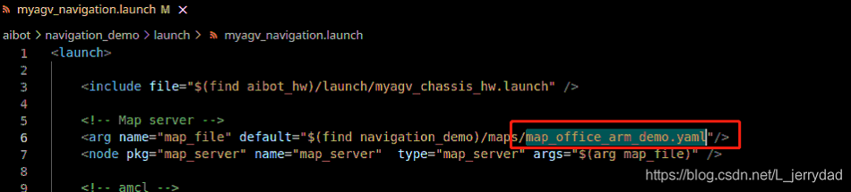

1. 将倒数第二行的注释取消，用鼠标遍选中52-54行的代码，按快捷键<kbd>Shift</kbd>+<kbd>/</kbd>快捷键可取消注释或注释代码段。这一步可以让我们在运行的时候能打开Rviz模拟器，进行地图定点导航。
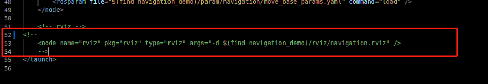
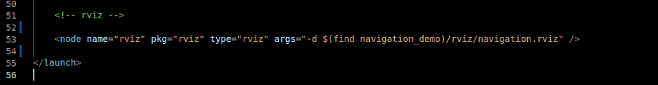
5. 保存修改文件并退出(VScode在运行的时候比较占内存，推荐修改完代码后关闭VScode，不然运行小车系统会非常卡顿，也可以使用vim等轻量化编辑器)
# 3.运行launch文件
1. 打开一个控制台终端(快捷键<kbd>Ctrl</kbd>+<kbd>Alt</kbd>+<kbd>T</kbd>),输入如下指令： 
```bash
roslaunch navigation_demo myagv_navigetion.launch
```
2. 可以看到开启了一个Rviz仿真窗口，在窗口中可以看到我们建好的地图以及小车在地图中的相对位置
**注意：小车的初始位置需要放置到我们建图的时候小车的出发位置，这样才能正常的使用地图及导航功能。**
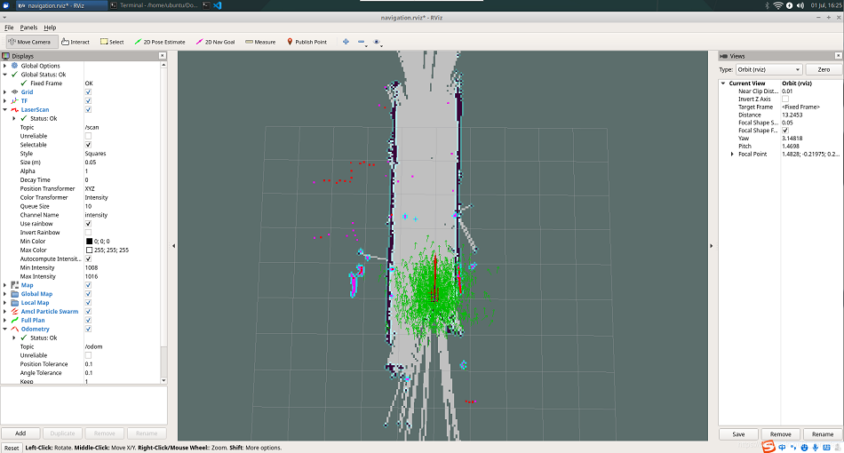
3. 点击顶部工具栏的“2D Nav Goal” 
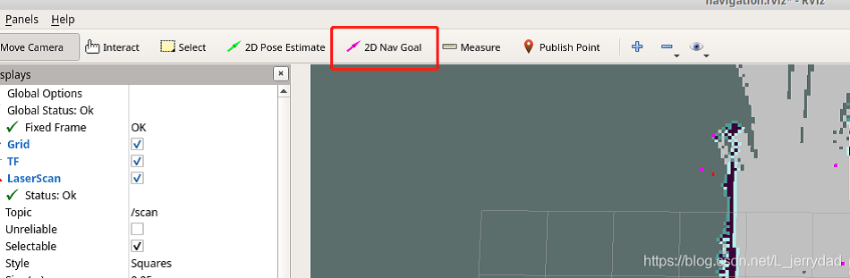
4. 点击地图上我们想要到达的点位，小车便会向着目标点位出发，同时还可以看到起点到目标点位间有一条小车的规划路径
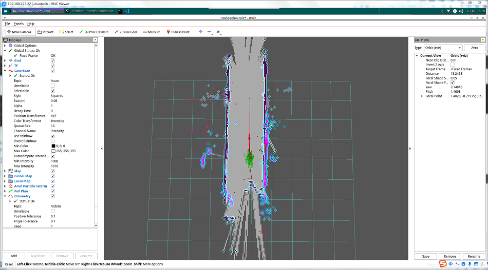
5. 小车到达目标点位，在Rviz界面中也可以看到空间的移动，并且在终端中会显示“Goal reached”
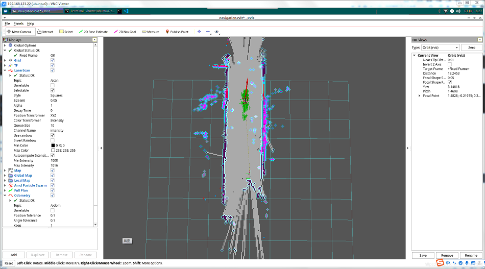
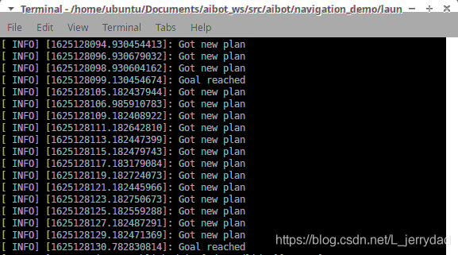

